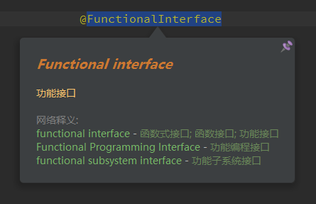
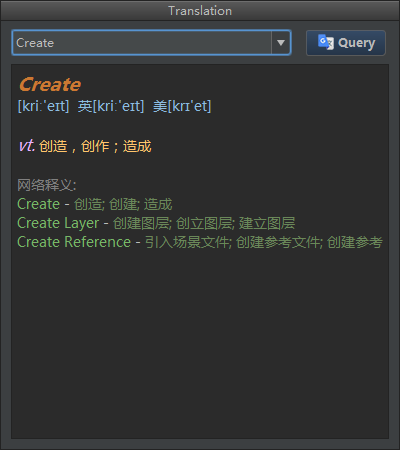
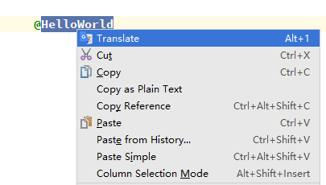
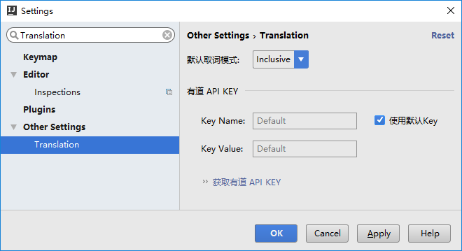

Translation [![GitHub release][release-img]][latest-release] [![Jetbrains Plugins][plugin-img]][plugin] [![Gitter][badge-gitter-img]][badge-gitter]
===========

### IntelliJ IDEA/Android Studio 翻译插件,可中英互译。

安装
----

- 使用**IDEA**内置插件系统:
  - <kbd>Preferences(Settings)</kbd> > <kbd>Plugins</kbd> > <kbd>Browse repositories...</kbd> > <kbd>搜索并找到"Translation"</kbd> > <kbd>Install Plugin</kbd>
- 手动:
  - 下载[`最新发布的插件包`][latest-release] -> <kbd>Preferences(Settings)</kbd> > <kbd>Plugins</kbd> > <kbd>Install plugin from disk...</kbd>

重启**IDEA**.

Actions
-------

Translation有四个Action，它们分别是：`Translation`, `Translate`, `Translate(Inclusive)` 和 `Translate(Exclusive)`.

- **Translation:** <kbd>Alt + 0</kbd> 打开翻译对话框，默认显示在工具栏上。
- **Translate:** <kbd>Alt + 1</kbd> 取词并翻译。如果有已选择的文本，优先从选择的文本内取词，否则以最大范围自动取词。此Action默认显示在编辑器右键菜单上。
  
- **Translate(Inclusive):** <kbd>Alt + 2</kbd> 取词并翻译。以最大范围自动取词，忽略手动选择的文本。
  
- **Translate(Exclusive):** <kbd>Alt + 3</kbd> 取词并翻译。自动取单个词，忽略手动选择的文本。
  

使用
----

1. **打开翻译对话框:**

   点击工具栏上的  图标即可打开翻译对话框。

2. **翻译编辑器中的文本:**

   在编辑器中 <kbd>选择文本或者鼠标指向文本</kbd> > <kbd>单击鼠标右键</kbd> > <kbd>Translate</kbd>

   

   或者使用快捷键<kbd>Alt + 0/1/2/3/4</kbd>进行翻译，详见 **[Actions](#actions)**

3. **自定义快捷键:**

   <kbd>Preferences(Settings)</kbd> > <kbd>Keymap</kbd> > <kbd>搜索Translation</kbd>。在需要添加快捷键Action上 <kbd>右键</kbd> > <kbd>add Keyboard Shortcut...</kbd> 设置快捷键（按<kbd>ESC</kbd>键可关闭气泡和翻译对话框）。

   

4. **设置有道API KEY:**

   <kbd>Preferences(Settings)</kbd> > <kbd>Other Settings</kbd> > <kbd>Translation</kbd>。 由于有道的API在查询请求数量上存在限制，如果在1小时内查询请求次数达到一定数量后将会暂时禁止查询一段时间（大概1小时）。如果很多人同时使用同一个KEY，可能会很容易就达到了限制条件，这就可以通过使用自己的KEY来避免（一人一个KEY基本足够用了）。

   

5. **如何获取有道API KEY？**

   <kbd>Preferences(Settings)</kbd> > <kbd>Other Settings</kbd> > <kbd>Translation</kbd> > <kbd>获取有道API KEY</kbd>

   或者 [**点击这里**](http://fanyi.youdao.com/openapi?path=data-mode) 也可申请有道API KEY。

更新日志
--------

## [v1.2.2](https://github.com/YiiGuxing/TranslationPlugin/tree/v1.2.2)(2016-09-27)

- UI适配
- 自动取词（[详细说明](#actions)）
- 气泡跟随编辑器滚动而滚动
- 添加默认快捷键，见[Actions](#actions)
- 使用Java1.6编译
- 修复: PluginException: cannot create class "cn.yiiguxing.plugin.translate.action.**" [#13][#13] [#14][#14]
- 修复: 与ideaVim插件ESC键冲突问题 [#18][#18]

[#13]:https://github.com/YiiGuxing/TranslationPlugin/issues/13 "Translation threw an uncaught PluginException"
[#14]:https://github.com/YiiGuxing/TranslationPlugin/issues/14 "Translate Error"
[#18]:https://github.com/YiiGuxing/TranslationPlugin/issues/18 "对话框在非聚焦状态下按ESC键关闭对话框的问题"

[完整的更新历史记录](./CHANGELOG.md)

[release-img]:        https://img.shields.io/github/release/YiiGuxing/TranslationPlugin.svg
[latest-release]:     https://github.com/YiiGuxing/TranslationPlugin/releases/latest
[badge-gitter-img]:   https://img.shields.io/gitter/room/YiiGuxing/TranslationPlugin.svg
[badge-gitter]:       https://gitter.im/TranslationPlugin/Lobby
[plugin-img]:         https://img.shields.io/badge/plugin-8579-orange.svg
[plugin]:             https://plugins.jetbrains.com/plugin/8579
