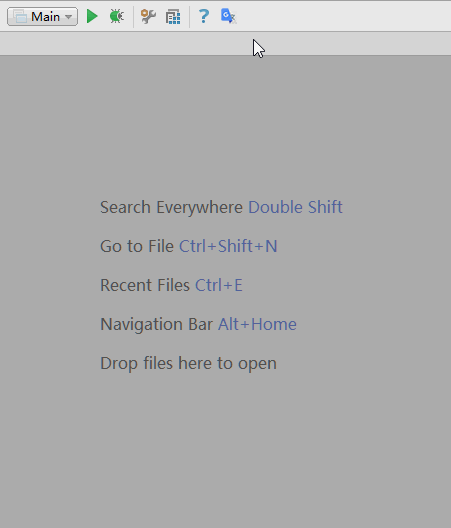
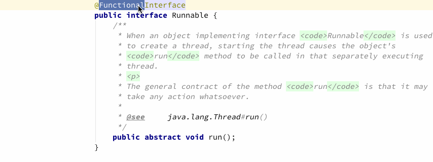
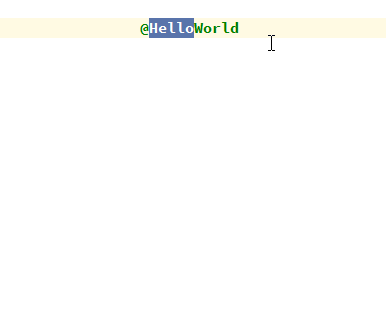
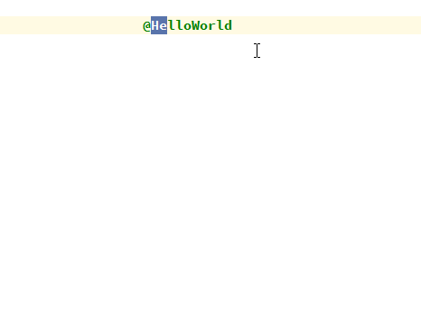
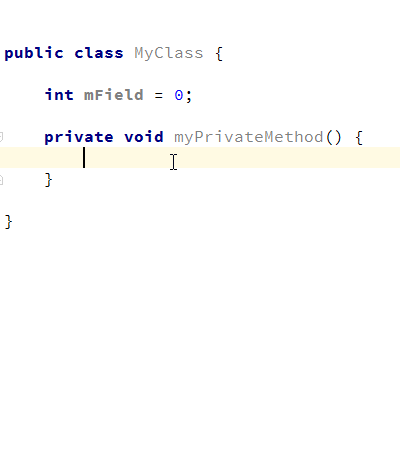
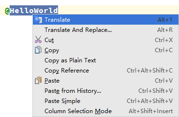
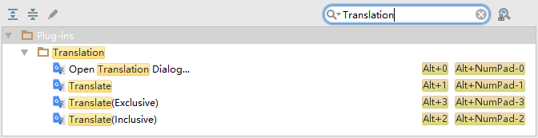
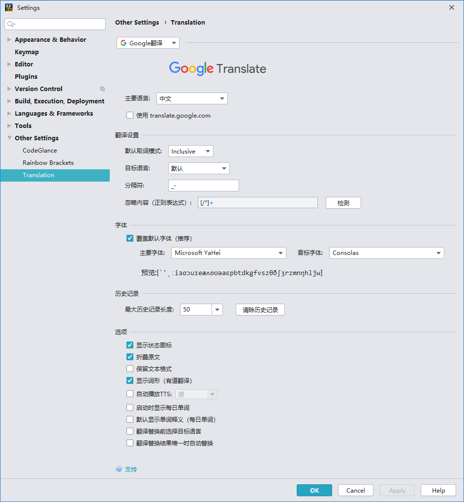

TranslationPlugin [![GitHub release][release-img]][latest-release] [![Jetbrains Plugins][plugin-img]][plugin] [![Gitter][badge-gitter-img]][badge-gitter]
=================

[][plugin]
[][plugin]
[][plugin]

### IntelliJ IDEA/Android Studio 翻译插件，支持中英互译、单词朗读。

安装
----

兼容除 MPS 外所有产品编译号为143以上的 Jetbrains IDE 产品。

支持的 IDE:
- Android Studio
- IntelliJ IDEA
- IntelliJ IDEA Community Edition
- PhpStorm
- WebStorm
- PyCharm
- PyCharm Community Edition
- RubyMine
- AppCode
- CLion
- DataGrip
- Rider

**使用 IDE 内置插件系统:**
- <kbd>Preferences(Settings)</kbd> > <kbd>Plugins</kbd> > <kbd>Browse repositories...</kbd> > <kbd>搜索并找到"Translation"</kbd> > <kbd>Install Plugin</kbd>

**手动:**
- 下载[`最新发布的插件包`][latest-release] -> <kbd>Preferences(Settings)</kbd> > <kbd>Plugins</kbd> > <kbd>Install plugin from disk...</kbd>

重启**IDE**.

Actions
-------

- **Show Translation Dialog...:** 默认快捷键<kbd>Alt + 0</kbd>，打开翻译对话框，默认显示在工具栏上。

  

- **Translate:** 取词并翻译。如果有已选择的文本，优先从选择的文本内取词，否则默认以最大范围自动取词（该取词模式可在Settings中配置）。默认显示在编辑器右键菜单上，默认快捷键为<kbd>Alt + 1</kbd>

  

- **Translate(Inclusive):** 取词并翻译。自动以最大范围取最近的所有词，忽略手动选择的文本。默认快捷键为<kbd>Alt + 2</kbd>

  

- **Translate(Exclusive):** 取词并翻译。自动取最近的单个词，忽略手动选择的文本。默认快捷键为<kbd>Alt + 3</kbd>

  

- **Translate And Replace...:** 翻译并替换。取词方式同`Translate`操作。默认显示在编辑器右键菜单上，默认快捷键为<kbd>Alt + R</kbd>

  

- **Translate Text Component:** 翻译一些文本组件（如快速文档、提示气泡、输入框……）中选中的文本。默认快捷键为<kbd>Alt + T</kbd>

  
  

使用
----

1. **打开翻译对话框:**

   点击工具栏上的  图标即可打开翻译对话框。

2. **翻译编辑器中的文本:**

   在编辑器中 <kbd>选择文本或者鼠标指向文本</kbd> > <kbd>单击鼠标右键</kbd> > <kbd>Translate</kbd>

   

   或者使用快捷键<kbd>Alt + 1/2/3</kbd>进行翻译（Mac下默认快捷键可能无效，需要自定义快捷键），详见 **[Actions](#actions)**

3. **自定义快捷键（Mac下默认快捷键可能无效）:**

   <kbd>Preferences(Settings)</kbd> > <kbd>Keymap</kbd> > <kbd>搜索Translation</kbd>。在需要添加快捷键Action上 <kbd>右键</kbd> > <kbd>add Keyboard Shortcut...</kbd> 设置快捷键（按<kbd>ESC</kbd>键可关闭气泡和翻译对话框）。

   

4. **设置有道API KEY:**

   <kbd>Preferences(Settings)</kbd> > <kbd>Other Settings</kbd> > <kbd>Translation</kbd>。 由于有道的API在查询请求数量上存在限制，如果在1小时内查询请求次数达到一定数量后将会暂时禁止查询一段时间（大概1小时）。如果很多人同时使用同一个KEY，可能会很容易就达到了限制条件，这就可以通过使用自己的KEY来避免（一人一个KEY基本足够用了）。

5. **如何获取有道API KEY？**

   <kbd>Preferences(Settings)</kbd> > <kbd>Other Settings</kbd> > <kbd>Translation</kbd> > <kbd>获取有道API KEY</kbd>

   或者 [**点击这里**](http://fanyi.youdao.com/openapi?path=data-mode) 也可申请有道API KEY。

6. **网络代理**

   支持HTTP代理，可到这里设置HTTP代理：
   <kbd>Preferences(Settings)</kbd> > <kbd>Appearance & Behavior</kbd> > <kbd>System Settings</kbd> > <kbd>HTTP Proxy</kbd>

7. **Settings(Preferences)**

   

更新日志
--------

## [v1.3.1][v1.3.1] (2016-11-7)

- 网络请求优化，支持网络代理 [#21][#21]
- 修复：气泡重叠显示

[v1.3.1]: https://github.com/YiiGuxing/TranslationPlugin/tree/v1.3.1
[#21]:    https://github.com/YiiGuxing/TranslationPlugin/issues/21 "支持网络代理"

[完整的更新历史记录](./CHANGELOG.md)

[release-img]: https://img.shields.io/github/release/YiiGuxing/TranslationPlugin.svg
[latest-release]: https://github.com/YiiGuxing/TranslationPlugin/releases/latest
[badge-gitter-img]: https://img.shields.io/gitter/room/YiiGuxing/TranslationPlugin.svg
[badge-gitter]: https://gitter.im/TranslationPlugin/Lobby
[plugin-img]: https://img.shields.io/badge/plugin-8579-orange.svg
[plugin]: https://plugins.jetbrains.com/plugin/8579
