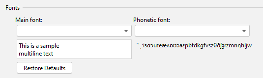

TranslationPlugin
=================

[![Jetbrains Plugins][plugin-img]][plugin]
[![License][license-img]][license]
[![Build Status][build-img-master]][travis-ci]
[![GitHub release][release-img]][latest-release]
[![Version][version-img]][plugin]
[![Downloads][downloads-img]][plugin]

### JetBrains IDE/Android Studio 翻译插件

特征
----
- 多翻译引擎
  - Google翻译
  - 有道翻译
  - 百度翻译
- 多语言互译
- 语音朗读
- 自动选词
- 自动单词拆分

兼容除 MPS 外所有产品编译号为143以上的 Jetbrains IDE 产品。  
支持的 IDE:
- Android Studio
- IntelliJ IDEA
- IntelliJ IDEA Community Edition
- PhpStorm
- WebStorm
- PyCharm
- PyCharm Community Edition
- RubyMine
- AppCode
- CLion
- DataGrip
- Rider

安装
----
- **使用 IDE 内置插件系统安装:**
  - <kbd>Preferences(Settings)</kbd> > <kbd>Plugins</kbd> > <kbd>Browse repositories...</kbd> > <kbd>搜索并找到"Translation"</kbd> > <kbd>Install Plugin</kbd>

- **手动安装:**
  - 下载[`最新发布的插件包`][latest-release] -> <kbd>Preferences(Settings)</kbd> > <kbd>Plugins</kbd> > <kbd>Install plugin from disk...</kbd>

重启**IDE**.

使用
----
1. **申请有道智云翻译服务（可选）:**
   - 注册[有道智云](http://ai.youdao.com)帐号并获取其**应用ID**和**应用密钥**
   - 绑定**应用ID**和**应用密钥**：<kbd>Preferences(Settings)</kbd> > <kbd>\[Other Settings]</kbd> > <kbd>Translation</kbd> > <kbd>有道翻译</kbd>

   注：请注意保管好你的**应用密钥**，防止其泄漏。如帐号欠费，将无法使用。

2. **申请百度翻译服务（可选）:**
   - 注册[百度翻译开放平台](http://api.fanyi.baidu.com/api/trans/product/desktop?req=developer)帐号并获取其**应用ID**和**应用密钥**
   - 绑定**应用ID**和**应用密钥**：<kbd>Preferences(Settings)</kbd> > <kbd>\[Other Settings]</kbd> > <kbd>Translation</kbd> > <kbd>百度翻译</kbd>

   注：请注意保管好你的**应用密钥**，防止其泄漏。如帐号欠费，将无法使用。

3. **开始翻译:**

   <kbd>选择文本或者鼠标指向文本</kbd> > <kbd>单击鼠标右键</kbd> > <kbd>Translate</kbd>

   或者使用快捷键进行翻译，详见 **[Actions](#actions)**

4. **切换翻译引擎:**

   点击状态栏的翻译引擎状态图标或者使用快捷键 <kbd>Ctrl</kbd> + <kbd>Shift</kbd> + <kbd>S</kbd>（Mac OS: <kbd>Control</kbd> + <kbd>Meta</kbd> + <kbd>Y</kbd>）可以快速切换翻译引擎，目前有谷歌翻译、有道翻译和百度翻译。

Actions
-------
- **Show Translation Dialog...**

  打开翻译对话框。默认显示在工具栏上。默认快捷键:

  - Windows - <kbd>Ctrl</kbd> + <kbd>Shift</kbd> + <kbd>O</kbd>
  - Mac OS - <kbd>Control</kbd> + <kbd>Meta</kbd> + <kbd>I</kbd>

- **Translate**

  取词并翻译。如果有已选择的文本，优先从选择的文本内取词，否则默认以最大范围自动取词（该取词模式可在Settings中配置）。默认显示在编辑器右键菜单上，默认快捷键:

  - Windows - <kbd>Ctrl</kbd> + <kbd>Shift</kbd> + <kbd>Y</kbd>
  - Mac OS - <kbd>Control</kbd> + <kbd>Meta</kbd> + <kbd>U</kbd>

- **Translate(Inclusive)**

  取词并翻译。自动以最大范围取最近的所有词，忽略手动选择的文本。默认快捷键: (无)

- **Translate(Exclusive)**

  取词并翻译。自动取最近的单个词，忽略手动选择的文本。默认快捷键: (无)

- **Translate and Replace...**

  翻译并替换。取词方式同`Translate`操作。默认显示在编辑器右键菜单上，默认快捷键:

  - Windows - <kbd>Ctrl</kbd> + <kbd>Shift</kbd> + <kbd>X</kbd>
  - Mac OS - <kbd>Control</kbd> + <kbd>Meta</kbd> + <kbd>O</kbd>

- **Translate Text Component**

  翻译一些文本组件（如快速文档、提示气泡、输入框……）中选中的文本，不支持自动取词。默认快捷键:

  - Windows - <kbd>Ctrl</kbd> + <kbd>Shift</kbd> + <kbd>O</kbd>
  - Mac OS - <kbd>Control</kbd> + <kbd>Meta</kbd> + <kbd>I</kbd>

- **Choose Translator**

  快速切换翻译引擎。默认快捷键:

  - Windows - <kbd>Ctrl</kbd> + <kbd>Shift</kbd> + <kbd>S</kbd>
  - Mac OS - <kbd>Control</kbd> + <kbd>Meta</kbd> + <kbd>Y</kbd>

FAQ
---
1. **翻译内容出现乱码怎么办？**

   **答**：出现乱码一般是因为字体中没有相应的字符的问题，可以到插件的设置页面修改字体以解决乱码问题（如下图所示）。
   
   

2. **出现网络错误或者网络连接超时怎么办？**

   **答**：  
   - 检查网络环境，确保网络畅通。
   - 检查是否是因为使用了代理软件而导致插件无法访问翻译API。
   - 检查IDE代理配置，查看是否是因为IDE代理配置导致的问题。
   - 如果使用的是谷歌翻译，检查谷歌翻译配置，查看是否勾选了`使用translate.google.com`选项，translate.google.com在国内是需要VPN才能访问的。另外，TTS功能使用的也是谷歌翻译的API。

3. **MacOS、Linux下无法保存应用密钥，出现校验签名失败?**

   **答**：可以尝试将密码保存方式改成`In KeePass`方式 (<kbd>Settings</kbd> > <kbd>Appearance & Behavior</kbd> > <kbd>System Settings</kbd> > <kbd>Passwords</kbd>)，原因与细节：
   - MacOS，请另阅 [#81](https://github.com/YiiGuxing/TranslationPlugin/issues/81)
   - Linux，请另阅 [#115](https://github.com/YiiGuxing/TranslationPlugin/issues/115)

4. **为什么2.0以前的版本快捷键在新版本都不能用了?**

   **答**：由于2.0以前的版本的快捷键大多与IDE默认的快捷键有冲突，抢占了IDE的默认快捷键。所以，从2.0版本以后，重新设置了插件的默认快捷键，而2.0以前的版本的快捷键已被废弃。

5. **快捷键不能使用怎么办？**

   **答**：快捷键不能使用可能是因为被其他插件或者外部应用占用了，可以为相应的操作重新设置新的快捷键。

更新日志
--------
## [v2.2](https://github.com/YiiGuxing/TranslationPlugin/tree/v2.2) (2018-11-03)

- 翻译替换：支持多种语言
- 有道翻译：显示词形

[完整的更新历史记录](./CHANGELOG.md)

[build-img-dev]: https://img.shields.io/travis/YiiGuxing/TranslationPlugin/dev.svg?style=flat-square
[build-img-master]: https://img.shields.io/travis/YiiGuxing/TranslationPlugin/master.svg?style=flat-square
[license-img]: https://img.shields.io/github/license/YiiGuxing/TranslationPlugin.svg?style=flat-square
[release-img]: https://img.shields.io/github/release/YiiGuxing/TranslationPlugin.svg?style=flat-square
[plugin-img]: https://img.shields.io/badge/JetBrainsPlugin-8579-orange.svg?style=flat-square
[downloads-img]: https://img.shields.io/jetbrains/plugin/d/8579.svg?style=flat-square
[version-img]: https://img.shields.io/jetbrains/plugin/v/8579.svg?style=flat-square&colorB=0091ea
[latest-release]: https://github.com/YiiGuxing/TranslationPlugin/releases/latest
[license]: https://github.com/YiiGuxing/TranslationPlugin/blob/master/LICENSE
[travis-ci]: https://travis-ci.org/YiiGuxing/TranslationPlugin
[plugin]: https://plugins.jetbrains.com/plugin/8579
