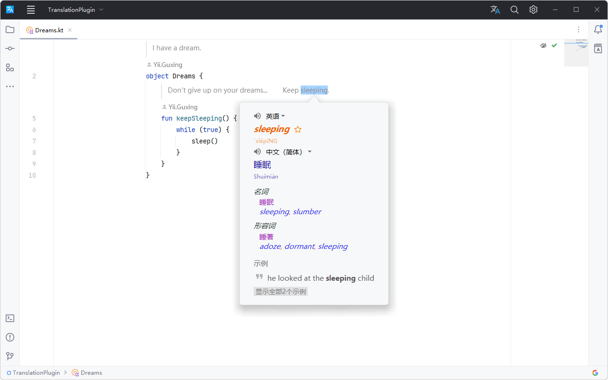

# Introduction :id=introduction

TranslationPlugin is an IntelliJ-based IDEs/Android Studio Translation Plugin.
It integrates many translation engines such as Google Translate, Microsoft Translate, DeepL Translate, etc.
You can translate the text, code comments, and code documents, etc. You want to translate in your IDE at any time.

## Features :id=features

- Multiple Translation Engines
    - Google Translate
    - Microsoft Translator
    - OpenAI Translator
    - DeepL Translator
    - Youdao Translate
    - Baidu Translate
    - Alibaba Translate
- Multiple languages inter-translation
- Text-to-speech
  - Microsoft Edge TTS
  - Google TTS
  - OpenAI TTS
- Document translation
- Automatic word selection
- Automatic word breaks
- Word Book

## Compatibility :id=compatibility

Supported IDE Products:
- Android Studio
- Aqua
- AppCode
- CLion
- DataGrip
- DataSpell
- GoLand
- HUAWEI DevEco Studio
- IntelliJ IDEA Community
- IntelliJ IDEA Ultimate
- MPS
- PhpStorm
- PyCharm Community
- PyCharm Professional
- Rider
- RubyMine
- RustRover
- WebStorm

# Quick Start :id=quick-start

## Installation :id=installation

  <iframe src="https://plugins.jetbrains.com/embeddable/install/8579" frameborder="none"></iframe>

**Installing from the plugin repository within the IDE (recommend):**
- <kbd>**Preferences(Settings)**</kbd> > <kbd>**Plugins**</kbd> > <kbd>**Marketplace**</kbd> >
  Search and find "**Translation**" > Install Plugin.
**Installing manually:**
- Download the latest plugin package compatible with your IDE on [GitHub Releases][gh:releases]
  or in the [JetBrains Marketplace][plugin:versions].
- <kbd>**Preferences(Settings)**</kbd> > <kbd>**Plugins**</kbd> > <kbd>⚙</kbd> >
  <kbd>**Install plugins from disk...**</kbd> > Select the plugin package and install (no need to unzip).

Restart the IDE after installation.

## Using The Plugin :id=usage

#### 1. Sign up for a translation service (optional) :id=usage-sing-up

Most translation services require user registration to access their services
(such as OpenAI, DeepL, Youdao Translate, etc.).
Therefore, you may need to create an account, obtain an **Authentication Key**,
and then bind the **Authentication Key** within the plugin: <kbd>**Preferences(Settings)**</kbd> > <kbd>**Tools**</kbd> >
<kbd>**Translation**</kbd> > <kbd>**General**</kbd> > <kbd>**Translation Engine**</kbd> > <kbd>**Configure...**</kbd>

#### 2. Begin translating :id=usage-start-translating

Select a text or hover the mouse over the text > <kbd>**Right-click**</kbd> > <kbd>**Translate**</kbd>.

?> Or use shortcuts for translation, as detailed in [Actions](#translate-action).

#### 3. Translate and replace :id=usage-translate-and-replace

Translate the target text and replace it.
If the target language is English, the output has several formats: `in the camel case`,
`with a word separator` (when the output contains multiple words) and `in the original format`.

?> *Instructions:* Select a text or hover the mouse over the text > <kbd>**Right-click**</kbd> >
<kbd>**Translate and replace...**</kbd> (editor only, please use shortcuts for Input box,
as detailed in [Actions](#translate-and-replace-action)).

_Editor:_

_Input box:_

?> _Enable right-click menu option:_ <kbd>**Translation Settings**</kbd> > <kbd>**Translate and Replace**</kbd> >
Enables the <kbd>**Add to context menu**</kbd> option.  
_Separator configuration:_ <kbd>**Translation Settings**</kbd> > <kbd>**Translate and Replace**</kbd> >
<kbd>**Separators**</kbd>.

#### 4. Translate documentation :id=usage-translate-doc

- Right-click within a documentation view (including editor inlay documentation rendered view)
  or within a documentation comment block > <kbd>**Translate Documentation**</kbd>
  (or click the Translate Documentation icon on the documentation view toolbar)
  to toggle the translation status of the documentation.
- When the "**Automatically translate documentation**" option is enabled,
  the documentation will be automatically translated when you view the Quick Documentation.

_Quick documentation:_

_Documentation comment:_

_Editor inlay documentation rendered view:_

?> _Enable the "**Automatically translate documentation**" option:_ <kbd>**Translation Settings**</kbd> >
<kbd>**Other**</kbd> > <kbd>**Automatically translate documentation**</kbd>.

!> *Note:* Editor inlay documentation does not support automatic translation.

#### 5. Switch translation engines :id=usage-switch-translation-engine

Click the translation engine icon in the status bar or use the shortcut <kbd>**Ctrl + Shift + S**</kbd>
(macOS: <kbd>**Control + Meta + Y**</kbd>) to switch between translation engines quickly.

[gh:releases]: https://github.com/YiiGuxing/TranslationPlugin/releases
[plugin:versions]: https://plugins.jetbrains.com/plugin/8579-translation/versions
[deepl]: https://www.deepl.com
[youdao-cloud]: https://ai.youdao.com
[baidu-dev]: https://fanyi-api.baidu.com/manage/developer
[ali-mt]: https://www.aliyun.com/product/ai/base_alimt

# Actions :id=actions

#### 1. Show Translation Dialog... :id=show-trans-dialog-action

Open the translation dialog, which appears by default on the toolbar. Default shortcut:
- Windows - <kbd>**Ctrl + Shift + O**</kbd>
- macOS - <kbd>**Control + Meta + I**</kbd>

#### 2. Translate :id=translate-action

Extract words and translate them.
If you have already selected a text, extract the words from the portion of the text you'd like to translate.
Otherwise, words are extracted automatically from the maximum range
(this extraction can be configured in **Translation Settings**).
This action is displayed by default in the editor's right-click context menu.
Default shortcut:
- Windows - <kbd>**Ctrl + Shift + Y**</kbd>
- macOS - <kbd>**Control + Meta + U**</kbd>

#### 3. Translate (inclusive) :id=translate-inclusive-action

Extract words and translate them.
Automatically extract and translate all words from a specific range, ignoring manually selected text.
Default shortcut: (None)

#### 4. Translate (exclusive) :id=translate-exclusive-action

Extract words and translate them.
Automatically extract the nearest single word, ignoring manually selected text.
Default shortcut: (None)

#### 5. Translate and Replace... :id=translate-and-replace-action

Translate and replace.
Available in editors and input boxes,
the word extraction method works the same as the [Translate Action](#translate-action).
Default shortcut:
- Windows - <kbd>**Ctrl + Shift + X**</kbd>
- macOS - <kbd>**Control + Meta + O**</kbd>

_Editor:_

_Input box:_

#### 6. Translate Documentation :id=translate-doc-action
##### 6.1. Toggle between Quick Documentation translations :id=toggle-quick-doc-translation-action

Toggle between the original and translated texts in Quick Documentation.
Displayed by default on the right-click menu and toolbar of the documentation view.
This action is available when the focus is on the Quick Documentation pop-up window or the documentation tool window.
Default shortcut (same as the [Translate Action](#translate-action)):
- Windows - <kbd>**Ctrl + Shift + Y**</kbd>
- macOS - <kbd>**Control + Meta + U**</kbd>

##### 6.2. Translate Documentation Comment :id=translate-doc-comment-action

Translate the contents of document comments.
This action is displayed by default in the editor's context menu (right-click to access)
and is available when the cursor is in the document's comment block.
Default shortcut: (None)

_Documentation comment:_

_Editor inlay documentation rendered view:_

#### 7. Translate the Text Component :id=translate-text-component-action

Translate selected text in some text components (such as Quick Docs, popup hints, input boxes, etc.).
This action does not support automatic word extraction.
Default shortcut (same as the [Translate Action](#translate-action)):
- Windows - <kbd>**Ctrl + Shift + Y**</kbd>
- macOS - <kbd>**Control + Meta + U**</kbd>

#### 8. Switch Translation Engine :id=switch-translation-engine-action

Quickly switch between translation engines. Default shortcut:
- Windows - <kbd>**Ctrl + Shift + S**</kbd>
- macOS - <kbd>**Control + Meta + Y**</kbd>

#### 9. Word of the Day :id=word-of-the-day-action

Display the "**Word of the Day**" dialog. Default shortcut: (None)

#### 10. Other :id=other-actions

- **Translation dialog shortcuts:**
  - Display the list of source languages - <kbd>**Alt + S**</kbd>
  - Display the list of target languages - <kbd>**Alt + T**</kbd>
  - Switch between languages - <kbd>**Alt + Shift + S**</kbd>
  - Pin/unpin a window - <kbd>**Alt + P**</kbd>
  - Play TTS - <kbd>**Alt/Meta/Shift + Enter**</kbd>
  - Save to Word Book - <kbd>**Ctrl/Meta + F**</kbd>
  - Show history - <kbd>**Ctrl/Meta + H**</kbd>
  - Copy translation - <kbd>**Ctrl/Meta + Shift + C**</kbd>
  - Clear input - <kbd>**Ctrl/Meta + Shift + BackSpace/Delete**</kbd>
  - Expand more translations - <kbd>**Ctrl/Meta + Down**</kbd>
  - Hide more translations - <kbd>**Ctrl/Meta + UP**</kbd>
- **Translation balloon shortcuts:**
  - Open dialog - <kbd>**Ctrl + Shift + Y**</kbd> / <kbd>**Control + Meta + U**</kbd>